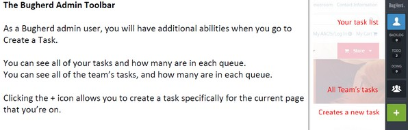

========
Bugherd
========

.. toctree::
   :hidden:

.. toctree::
   :titlesonly:
   :maxdepth: -1

Using Bugherd
-------------

After you’ve created your account including setting up your password, please make sure you login on the Bugherd.com site before every testing session.

You can login here: `https://www.bugherd.com/users/sign_in <https://www.bugherd.com/users/sign_in>`_

After Initial Login
^^^^^^^^^^^^^^^^^^^

After logging in initially, you may see the following screen:

.. image:: ./_Static/Bugherd_Admin_User_Instructions_V1_1.jpg
   :alt:
   :scale: 80
   

Click “Manage Project” to view the task board: `BugHerd <https://www.bugherd.com/projects/73659/kanban>`_ Or Click “view site” to go right to the homepage of the test site: `aaos.org <http://wwwstage.aaos.org/Default.aspx?ssopc=1>`_

Upon your first visit as a Bugherd admin, you will be presented with a short tutorial.
^^^^^^^^^^^^^^^^^^^^^^^^^^^^^^^^^^^^^^^^^^^^^^^^^^^^^^^^^^^^^^^^^^^^^^^^^^^^^^^^^^^^^^
After the tutorial, you can start perusing the site, or progressing through your area’s content pages to start validating your content appears where and how it should.

=============

Reporting an Issue (Creating a Task)
---------------------------------------

To report an issue on the page you’re currently on, click the + icon on the toolbar.
^^^^^^^^^^^^^^^^^^^^^^^^^^^^^^^^^^^^^^^^^^^^^^^^^^^^^^^^^^^^^^^^^^^^^^^^^^^^^^^^^^^^^

Next, select an area of the screen or an element on the screen you wish to report on
^^^^^^^^^^^^^^^^^^^^^^^^^^^^^^^^^^^^^^^^^^^^^^^^^^^^^^^^^^^^^^^^^^^^^^^^^^^^^^^^^^^^^
   

**As an admin user you will see the following**:

=============

The admin version of the Create Task form has the following sections:
^^^^^^^^^^^^^^^^^^^^^^^^^^^^^^^^^^^^^^^^^^^^^^^^^^^^^^^^^^^^^^^^^^^^^
 

   **Description**: Fill out with enough detail to communicate the issue. Be as concise as possible, but include any pertinent details.
  

   **Assignee**: If you know the exact person responsible, assign them.

   If this is something fixable via the admin interface, assign toyourself.
   If necessary, you may assign multiple team members.

   	**Severity**: For severity, choose “not set” if you are unsure. TDS can assignlater. Other options are:

   	**Critical** = Can’t go live until issue is fixed

   	**Important** = Should be fixed before go-live, but not critical

   	**Normal** = Usually Items that can be fixed in admin interface

   	**Minor** = Small items; can possibly be addressed after launch

   **Tags**: Tags are very important to help organize and prioritize tasks correctly. At the end of these instructions you will find a Bugherd Tag Legend. There are 6 types of Tag. The first three youshould apply to each task you create:

1.   **Issue Type** (Required): Nearly all issues will be one of three types: *Data, Format or Functionality*. 

	* **Data**:  The wrong text or images appear on a page, or don’t appear when they should. Be sure to compare to the original page on the current aaos.org site to confirm the source page shows something different than the Ektron site page. 
		
		**Examples**: `An article lists the wrong author. An issue lists the wrong articles. The published date for an article is incorrect. A different image appears for an identical article on the current aaos.org site.`

	*  **Format**:  Use this tag to point out issues related to how something looks. 

		**Examples**: `A sentence on a page seems to have a different font type or font size than the rest of the article. The paragraph headings on a page are all a different color than they are expected to be. The caption under a figure has a font size that is way too small.`

		**PLEASE NOTE**: Most, if not all “format” issue types are expected to be fixable by you and your team in the Ektron admin interface. If the format issue is within the content portions of the page, you should make yourself the Assignee on the create task form as well so you can create a task list you and your team can use to fix the content after the final conversion.*

	* **Function**:  Something on the site happens unexpectedly, or doesn’t it happen when it should. Most often these are site “bugs” that the developers need to fix. 

		**Examples**: `Clicking ona main item in the mega menu fails to show the dropdown sub-menu. Filtering items on the store listing page by the facets in the left navigation produces unexpected results. When logged in as a non-member you can access content that should be only accessible to members.`

2.  **Site Template** (Required): 

	Each page on the site uses an Ektron custom template. Most are self-evident (ie. Landing Page, Content Page, Article Page) and you may use   the appropriate tag for the page template if you can identify it. If you are not sure, use the tag template and TDS staff will identify the template and place the proper tag.

|
3.  **Page Element** (Required):
 
	Each page is made up of various elements that can be identified using one of the tags in the Page Element list. If you don’t see a page element tag that applies, use the tag element and TDS will assign the proper tag.

4.  **Area of Responsibility** (If applicable): 

	Use this tag if the content you are creating a task for is specific to your area. The tags are identical to the values in the Assigned  Department column in the Master Content Inventory spreadsheet.

5.  **Periodical Type** (if applicable): 

	Use if referring to one of the landing pages or article detail pages for AAOS Now or one of the journals.

6.  **Design Type**: (if applicable): 

	Use ONLY if the issue you are reporting is related to a specific rendering of the page. Use desktop if you only see the issue on the desktop version of the site, and mobile if you only see the issue when you view the mobile version.

   **Other Items**:

	404 Errors: For any link that doesn’t work or returns a 404 error, you will need to submit a ticket on the original page, not the 404 page. After you get a 404 error you may hit the back button in your browse then click the link to submit a ticket.

.. image:: ./_Static/2015-10-28_09_55_18-Bugherd_Admin_User_Instructions_V1_1.pdf_-_Adobe_Acrobat_Pro_DC.jpg
   :alt:
   :scale: 80

Bugherd Tag Legend
--------------------

   Please use all tags that apply for each BugHerd ticket you
   submit.  Enter them one at a time (you don’t need to separate with a
   comma or semi-colon).

   +--------------------------+--------------------------+--------------------------+
   | Tag Type                 | Bugherd Tag              | What to Use it For       |
   +--------------------------+--------------------------+--------------------------+
   | Issue Type               | format                   | Issues related to        |
   |                          |                          | formatting such as font  |
   |                          |                          | type, font size, font    |
   |                          |                          | color,                   |
   |                          |                          | bold/italics/underline,  |
   |                          |                          | link color, image        |
   |                          |                          | size/placement, etc.     |
   +--------------------------+--------------------------+--------------------------+
   | Issue Type               | data                     | Issues related to        |
   |                          |                          | incorrect data being     |
   |                          |                          | converted (ie wrong      |
   |                          |                          | article title, wrong     |
   |                          |                          | article links in an      |
   |                          |                          | issue, wrong author,     |
   |                          |                          | incorrect images on a    |
   |                          |                          | page, etc.)              |
   +--------------------------+--------------------------+--------------------------+
   | Issue Type               | function                 | Issues related to        |
   |                          |                          | functionality of the web |
   |                          |                          | site (ie incorrect       |
   |                          |                          | permissions to view/not  |
   |                          |                          | view a page, dropdown    |
   |                          |                          | menu for Education       |
   |                          |                          | doesn't work, when       |
   |                          |                          | choosing facets to       |
   |                          |                          | narrow search results    |
   |                          |                          | nothing happens, etc.)   |
   +--------------------------+--------------------------+--------------------------+
   | Site Template            | homepage                 | Any issue (data, format, |
   |                          |                          | functionality) on the    |
   |                          |                          | homepage                 |
   +--------------------------+--------------------------+--------------------------+
   | Site Template            | landing page             | Any issue (data, format, |
   |                          |                          | functionality) on a      |
   |                          |                          | landing page Includes    |
   |                          |                          | Landing Page A, Landing  |
   |                          |                          | Page B, Landing Page C,  |
   |                          |                          | Subspeciality Landing    |
   |                          |                          | Page, Periodical/AAOS    |
   |                          |                          | Now Main Landing Page,   |
   |                          |                          | Periodical/AAOS Now      |
   |                          |                          | Issue Landing Page       |
   +--------------------------+--------------------------+--------------------------+
   | Site Template            | content page             | Any issue (data, format, |
   |                          |                          | functionality) on a page |
   |                          |                          | using the Content        |
   |                          |                          | template                 |
   +--------------------------+--------------------------+--------------------------+
   | Site Template            | article detail           | Any issue (data, format, |
   |                          |                          | functionality) on a page |
   |                          |                          | using the Article detail |
   |                          |                          | template                 |
   +--------------------------+--------------------------+--------------------------+
   | Site Template            | search page              | Any issue (data, format, |
   |                          |                          | functionality) on the    |
   |                          |                          | search page or           |
   |                          |                          | pertaining to search     |
   |                          |                          | results outside of the   |
   |                          |                          | store                    |
   +--------------------------+--------------------------+--------------------------+
   | Site Template            | AM site                  | Any issue (data, format, |
   |                          |                          | functionality) on a      |
   |                          |                          | template for the Annual  |
   |                          |                          | Meeting microsite        |
   +--------------------------+--------------------------+--------------------------+
   | Site Template            | course listing           | Any issue (data, format, |
   |                          |                          | functionality) on a      |
   |                          |                          | event listing page in    |
   |                          |                          | the store A listing page |
   |                          |                          | contains a list of       |
   |                          |                          | courses or events based  |
   |                          |                          | on a calendar daypart    |
   |                          |                          | (day/month/year) or      |
   |                          |                          | another facet (course    |
   |                          |                          | type, course format,     |
   |                          |                          | etc.).                   |
   +--------------------------+--------------------------+--------------------------+
   | Site Template            | course detail            | Any issue (data, format, |
   |                          |                          | functionality) on a      |
   |                          |                          | event detail page for a  |
   |                          |                          | specific course or event |
   |                          |                          | An event detail pages    |
   |                          |                          | lists all of the         |
   |                          |                          | pertinent information    |
   |                          |                          | for a single event or    |
   |                          |                          | course.                  |
   +--------------------------+--------------------------+--------------------------+
   | Site Template            | product listing          | Any issue (data, format, |
   |                          |                          | functionality) on a      |
   |                          |                          | product listing page in  |
   |                          |                          | the store A listing page |
   |                          |                          | contains a list of items |
   |                          |                          | in the store either      |
   |                          |                          | related to a single      |
   |                          |                          | topic/category, or       |
   |                          |                          | filtered by a facet in   |
   |                          |                          | the left navigation bar. |
   +--------------------------+--------------------------+--------------------------+
   | Site Template            | product detail           | Any issue (data, format, |
   |                          |                          | functionality) on a      |
   |                          |                          | product detail page for  |
   |                          |                          | a specific item in the   |
   |                          |                          | store                    |
   +--------------------------+--------------------------+--------------------------+
   | Site Template            | committee listing        | Any issue (data, format, |
   |                          |                          | functionality) on the    |
   |                          |                          | committee listing page A |
   |                          |                          | listing page contains a  |
   |                          |                          | list of committees       |
   |                          |                          | related to a single      |
   |                          |                          | topic/category.          |
   +--------------------------+--------------------------+--------------------------+
   | Site Template            | committee detail         | Any issue (data, format, |
   |                          |                          | functionality) on the    |
   |                          |                          | page that lists all the  |
   |                          |                          | details for a specific   |
   |                          |                          | committee.               |
   +--------------------------+--------------------------+--------------------------+
   | Site Template            | video gallery            | Any issue (data, format, |
   |                          |                          | functionality) on the    |
   |                          |                          | Video Gallery page,      |
   |                          |                          | including the video      |
   |                          |                          | player.                  |
   +--------------------------+--------------------------+--------------------------+

   |

   +--------------------------+--------------------------+--------------------------+
   | Tag Type                 | Bugherd Tag              | What to Use it For       |
   +--------------------------+--------------------------+--------------------------+
   | Site Template            | podcast                  | Any issue (data, format, |
   |                          |                          | functionality) on the    |
   |                          |                          | podcasts page.           |
   +--------------------------+--------------------------+--------------------------+
   | Site Template            | my library               | Any issue (data, format, |
   |                          |                          | functionality) found on  |
   |                          |                          | the My Library page      |
   +--------------------------+--------------------------+--------------------------+
   | Site Template            | my aaos                  | Any issue (data, format, |
   |                          |                          | functionality) found on  |
   |                          |                          | the My AAOS page         |
   +--------------------------+--------------------------+--------------------------+
   | Page Element             | mega menu                | Any issue (data, format, |
   |                          |                          | functionality) with the  |
   |                          |                          | Mega Menu                |
   +--------------------------+--------------------------+--------------------------+
   | Page Element             | dashboard                | Any issue (data, format, |
   |                          |                          | functionality) with the  |
   |                          |                          | member dashboard element |
   +--------------------------+--------------------------+--------------------------+
   | Page Element             | non-targeted card        | Any issue (data, format, |
   |                          |                          | functionality) with a    |
   |                          |                          | content card that is     |
   |                          |                          | non-targeted (doesn't    |
   |                          |                          | change depending on      |
   |                          |                          | certain conditions of    |
   |                          |                          | logged-in user) Examples |
   |                          |                          | would include external   |
   |                          |                          | ads, periodical          |
   |                          |                          | highlights, etc.         |
   +--------------------------+--------------------------+--------------------------+
   | Page Element             | targeted card            | Any issue (data, format, |
   |                          |                          | functionality) with a    |
   |                          |                          | content card that        |
   |                          |                          | contains targeted        |
   |                          |                          | content (content can     |
   |                          |                          | change depending on      |
   |                          |                          | certain conditions of    |
   |                          |                          | logged-in user).         |
   |                          |                          |                          |
   |                          |                          | Examples would be        |
   |                          |                          | Upcoming Events,         |
   |                          |                          | Targeted Internal Ad,    |
   |                          |                          | etc.                     |
   +--------------------------+--------------------------+--------------------------+
   | Page Element             | left nav                 | Any issue (data, format, |
   |                          |                          | functionality) related   |
   |                          |                          | to the dynamic           |
   |                          |                          | navigation in the left   |
   |                          |                          | column                   |
   +--------------------------+--------------------------+--------------------------+
   | Page Element             | body                     | Any issue (data, format, |
   |                          |                          | functionality) related   |
   |                          |                          | to the content within    |
   |                          |                          | the body of the page     |
   |                          |                          | This is usually the main |
   |                          |                          | content that is added to |
   |                          |                          | the page via the Ektron  |
   |                          |                          | admin tool, or came over |
   |                          |                          | to the site during       |
   |                          |                          | conversion.              |
   +--------------------------+--------------------------+--------------------------+
   | Page Element             | footer                   | Any issue (data, format, |
   |                          |                          | functionality) related   |
   |                          |                          | to the footer on the     |
   |                          |                          | bottom of each site page |
   +--------------------------+--------------------------+--------------------------+
   | Page Element             | store nav                | Any issue (data, format, |
   |                          |                          | functionality) related   |
   |                          |                          | to the facet navigation  |
   |                          |                          | in the left hand menu on |
   |                          |                          | store pages              |
   +--------------------------+--------------------------+--------------------------+
   | Page Element             | periodical links         | Any issue (data, format, |
   |                          |                          | functionality) related   |
   |                          |                          | to the Periodical Links  |
   |                          |                          | located in the upper     |
   |                          |                          | left column of all the   |
   |                          |                          | periodical and AAOS Now  |
   |                          |                          | pages                    |
   +--------------------------+--------------------------+--------------------------+
   | Page Element             | image slider             | Any issue (data, format, |
   |                          |                          | functionality) related   |
   |                          |                          | to the image slider      |
   |                          |                          | found on some landing    |
   |                          |                          | pages                    |
   +--------------------------+--------------------------+--------------------------+
   | Page Element             | tabbed content           | Any issue (data, format, |
   |                          |                          | functionality) related   |
   |                          |                          | to the tabbed content    |
   |                          |                          | element found on some    |
   |                          |                          | landing pages            |
   +--------------------------+--------------------------+--------------------------+
   | Page Element             | video player             | Any issue (data, format, |
   |                          |                          | functionality) related   |
   |                          |                          | to the video player on   |
   |                          |                          | any given page.          |
   +--------------------------+--------------------------+--------------------------+
   | Page Element             | hero image               | Any issue (data, format, |
   |                          |                          | functionality) related   |
   |                          |                          | to the hero image OR the |
   |                          |                          | breadcrumb navigation    |
   |                          |                          | contained within         |
   +--------------------------+--------------------------+--------------------------+
   | Page Element             | content list             | Any issue (data, format, |
   |                          |                          | functionality) related   |
   |                          |                          | to content list element  |
   |                          |                          | found on Landing Page C  |
   +--------------------------+--------------------------+--------------------------+
   | Area of Responsibility   | CMS                      | Convention and Meeting   |
   |                          |                          | Services Dept.           |
   +--------------------------+--------------------------+--------------------------+
   | Area of Responsibility   | DEMECO                   | Dept of Electronic       |
   |                          |                          | Media, Exams and Course  |
   |                          |                          | Operations               |
   +--------------------------+--------------------------+--------------------------+
   | Area of Responsibility   | SPEC                     | Dept of Specialty        |
   |                          |                          | Societies                |
   +--------------------------+--------------------------+--------------------------+
   | Area of Responsibility   | EDU                      | Education Dept.          |
   +--------------------------+--------------------------+--------------------------+

   |

   +--------------------------+--------------------------+--------------------------+
   | Tag Type                 | Bugherd Tag              | What to Use it For       |
   +--------------------------+--------------------------+--------------------------+
   | Area of Responsibility   | EXEC                     | Executive Dept.          |
   +--------------------------+--------------------------+--------------------------+
   | Area of Responsibility   | OGR                      | Office of Government     |
   |                          |                          | Relations                |
   +--------------------------+--------------------------+--------------------------+
   | Area of Responsibility   | HR                       | Human Resources Dept.    |
   +--------------------------+--------------------------+--------------------------+
   | Area of Responsibility   | INTL                     | International Dept.      |
   +--------------------------+--------------------------+--------------------------+
   | Area of Responsibility   | IS                       | Dept of Technology and   |
   |                          |                          | Data Services            |
   +--------------------------+--------------------------+--------------------------+
   | Area of Responsibility   | LEGAL                    | Legal Dept.              |
   +--------------------------+--------------------------+--------------------------+
   | Area of Responsibility   | MBRSVCS                  | Member Services Dept.    |
   +--------------------------+--------------------------+--------------------------+
   | Area of Responsibility   | MKTG                     | Marketing Dept.          |
   +--------------------------+--------------------------+--------------------------+
   | Area of Responsibility   | PR                       | Public Relations Dept.   |
   +--------------------------+--------------------------+--------------------------+
   | Area of Responsibility   | PUBS                     | Publications Dept.       |
   +--------------------------+--------------------------+--------------------------+
   | Area of Responsibility   | RSRCH                    | Research and Scientific  |
   |                          |                          | Affairs Dept.            |
   +--------------------------+--------------------------+--------------------------+
   | Periodical Type          | AAOSNOW                  | Any issue (data, format, |
   |                          |                          | functionality) found in  |
   |                          |                          | any of the AAOS Now      |
   |                          |                          | description, full        |
   |                          |                          | article or main/issue    |
   |                          |                          | landing pages            |
   +--------------------------+--------------------------+--------------------------+
   | Periodical Type          | OKOJ                     | Any issue (data, format, |
   |                          |                          | functionality) found in  |
   |                          |                          | any of the OKOJ          |
   |                          |                          | abstract, full article   |
   |                          |                          | or main/issue landing    |
   |                          |                          | pages                    |
   +--------------------------+--------------------------+--------------------------+
   | Periodical Type          | JBJS                     | Any issue (data, format, |
   |                          |                          | functionality) found in  |
   |                          |                          | any of the JBJS abstract |
   |                          |                          | or main/issue landing    |
   |                          |                          | pages                    |
   +--------------------------+--------------------------+--------------------------+
   | Periodical Type          | JAAOS                    | Any issue (data, format, |
   |                          |                          | functionality) found in  |
   |                          |                          | any of the JAAOS         |
   |                          |                          | abstract or main/issue   |
   |                          |                          | landing pages            |
   +--------------------------+--------------------------+--------------------------+
   | Design Type              | desktop                  | Any format or            |
   |                          |                          | functionality issue      |
   |                          |                          | found ONLY in the        |
   |                          |                          | desktop version of a     |
   |                          |                          | page                     |
   +--------------------------+--------------------------+--------------------------+
   | Design Type              | mobile                   | Any format or            |
   |                          |                          | functionality issue      |
   |                          |                          | found ONLY in the mobile |
   |                          |                          | version of a page        |
   +--------------------------+--------------------------+--------------------------+