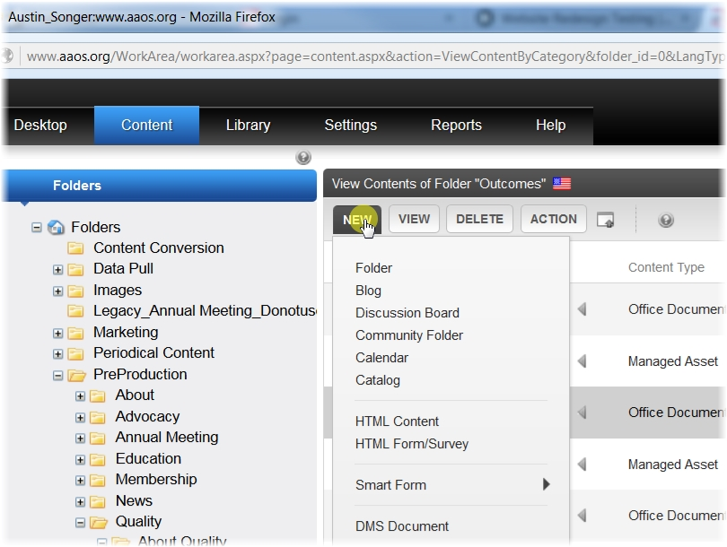
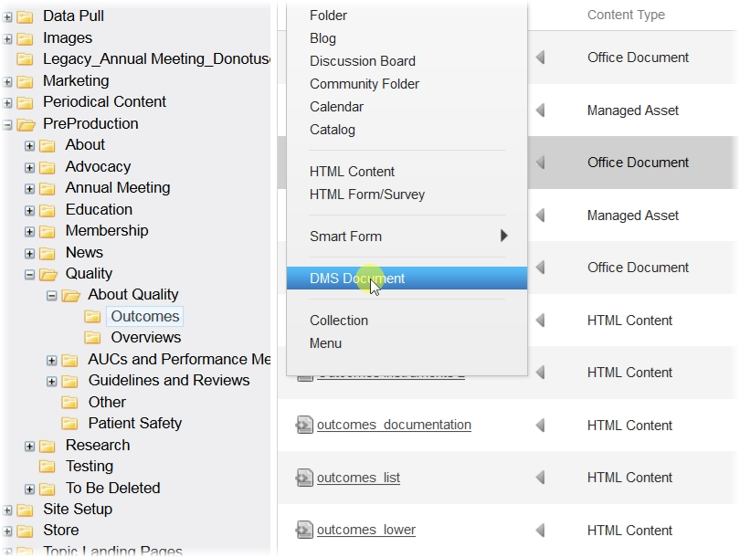
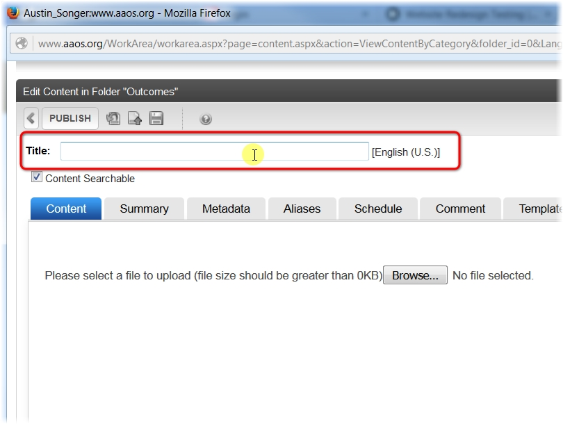
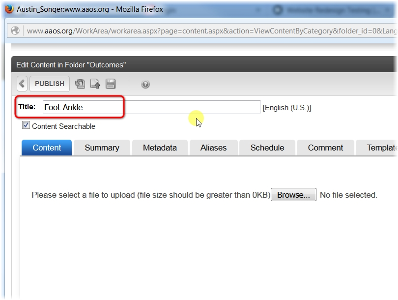
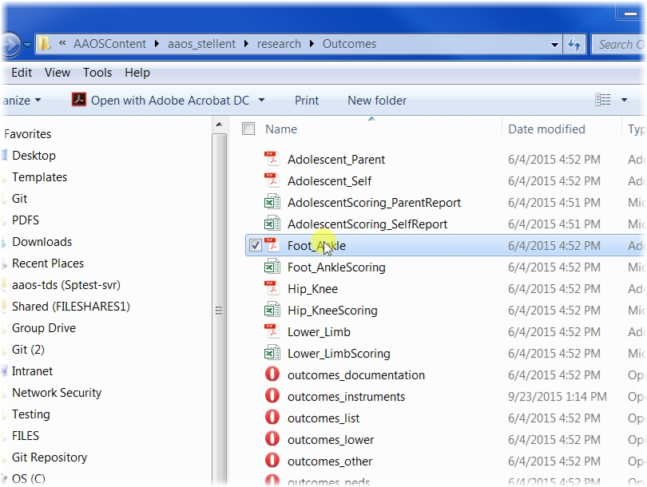
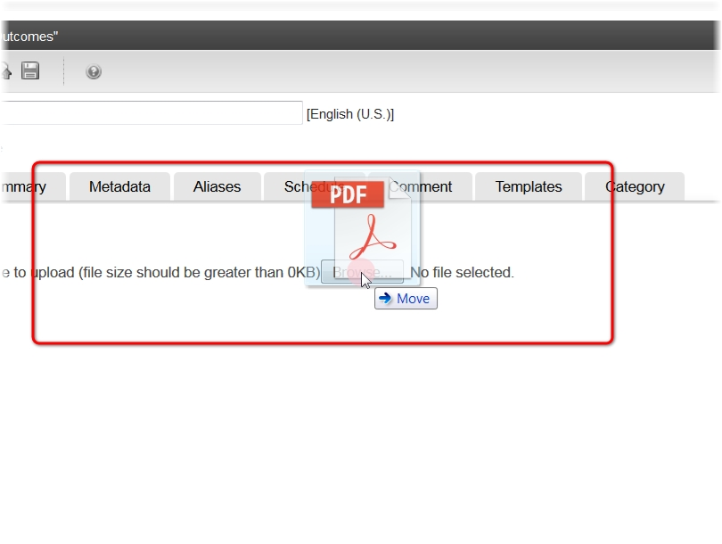
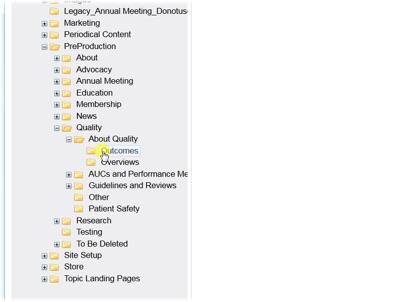
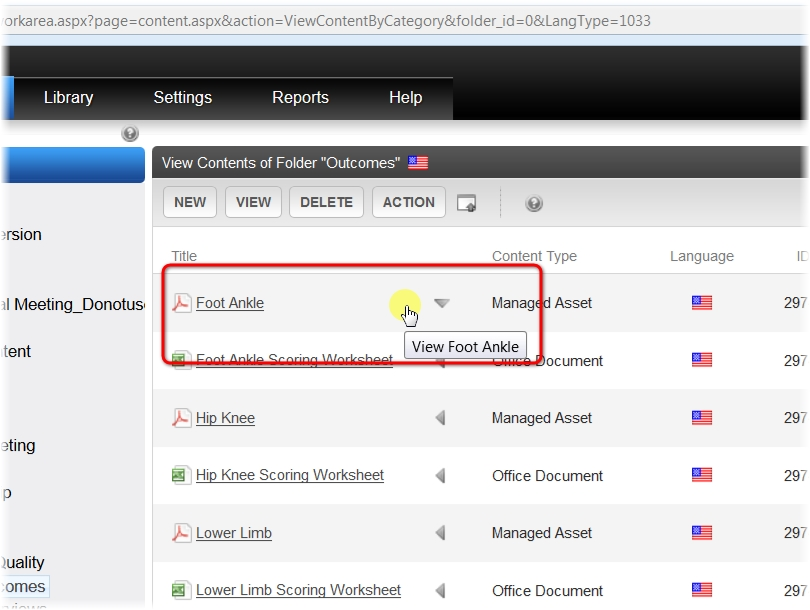

=======================================
Uploading File To Ektron
=======================================

.. toctree::
   :maxdepth: 4
   :numbered:

----------
ClICK NEW
----------

--------------------
CLICK DMS DOCUMENT
--------------------

------------

---------------------------------
ENTER THE TITLE OF THE DOCUMENT
---------------------------------

   

------------

---------------------------------
DRAG AND DROP THE FILE
---------------------------------

.. image:: ./_Static/UFTE-07.jpg
   :scale: 50   

------------

CLICK PUBLISH
~~~~~~~~~~~~~
.. image:: ./_Static/UFTE-08.jpg
   :scale: 50
   

------------

LOADING PAGE WILL APPEAR
~~~~~~~~~~~~~~~~~~~~~~~~~~~

------------

NOW YOU CAN CLICK THE FOLDER THAT YOU UPLOADED THE FILE IN
~~~~~~~~~~~~~~~~~~~~~~~~~~~~~~~~~~~~~~~~~~~~~~~~~~~~~~~~~~~

------------

YOU WILL NOW SEE THE FILE IN THE CONTENTS OF THE FOLDER
~~~~~~~~~~~~~~~~~~~~~~~~~~~~~~~~~~~~~~~~~~~~~~~~~~~~~~~

