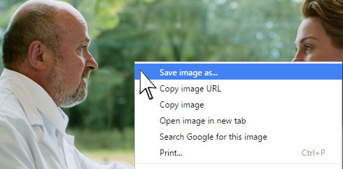
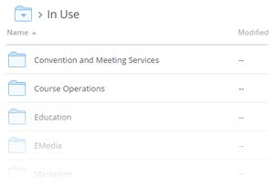

=================================================
AAOS.org Web Site Image Guidelines
=================================================

.. toctree::
      :hidden:

.. toctree::
      :titlesonly:
      :maxdepth: -1

Imagery should complement web text
==================================

- Our preferred style is straightforward, approachable – employing pleasant lighting and optimistic settings. It should reflect forward-thinking, innovation and inclusiveness. It should reflect our organization’s professional expertise while conveying openness to the public and empathetic patient care.
- Think about an image being action focused vs. product focused

Imagery should complement key audience: clinical, patient or physician
=======================================================================

- When showing physicians:
		- Reflect the spectrum of practice areas
		- Strive for diversity in terms of sex, ethnicity, race, age and career stage
		- Edit imagery to eliminate stethoscopes or other non-orthopaedic instruments/settings
		- Ensure physicians appear professional, empathetic, and approachable; not careless.

FAQ
---

Where can I find images?
^^^^^^^^^^^^^^^^^^^^^^^^
- AAOS owned images: Joan Golembiewski and her staff in publications keep a library of Academy owned imagery, but a sample subset is available in Dropbox according to audience: clinical, patient and physician.
- Each core team member should have received a link to Dropbox where they can look at sample imagery. You must have a DropBox account linked to your AAOS.org email address to access. `Click Here for Website Image Library Dropbox <https://www.dropbox.com/sh/np0ij75vb0g5deu/AACoh8222S1dEp9n8pJnLYC1a?dl=0>`_ .

How do I use images that are already in Dropbox?
^^^^^^^^^^^^^^^^^^^^^^^^^^^^^^^^^^^^^^^^^^^^^^^^^
- Images that you can use are located within the subfolders of the **“Available”** `Subfolder in Dropbox <https://www.dropbox.com/sh/gnpa3j3twqsq5kf/AAB9pXZjJcyPFMrszMhVggama?dl=0>`_ , divided into AAOS Images (photos taken by staff or commissioned by AAOS) and Stock Images (obtained via ThinkStock or similar source). Clicking into either folder will reveal subfolders named to help find certain types of images faster. You may click on the images to view them.

- If you think you’ve found a suitable image, **right-click** on the image in Dropbox, and choose **“Save Image As”** to save it locally. You may also choose Copy Image to copy it to your clipboard (see figure to the left).

- Now go to the Image Review `Submission Form <https://form.jotform.com/AAOSForms/ImageReviewSubmission>`_ and fill it out as completely as possible. Make sure you indicate in the proper field that the image you wish to use is in the Website Image Library on **Dropbox**. Include a copy of the image *(upload the file you just downloaded, or paste the image in the proper box)* and include any editing instructions you may have.

- The request will be sent to Abel and Suzanne. Once reviewed/edited and approved, they will deposit the image file you are to use inside the “In Use” folder, under your area’s subfolder. They will also send you a notification that it’s ready for you to use.

I looked in Dropbox and don’t see anything that fits my needs. Where can I get another image?
^^^^^^^^^^^^^^^^^^^^^^^^^^^^^^^^^^^^^^^^^^^^^^^^^^^^^^^^^^^^^^^^^^^^^^^^^^^^^^^^^^^^^^^^^^^^^^^^^^^^^
- The preferred stock image provider of AAOS is Thinkstock (http://www.thinkstock.com). Please look here first for new images.
- At present time, the Academy has three licenses for ThinkStock across the enterprise. AAOS staff graphic designers, Abel Jimenez and Suzanne O’Reilly have accounts.
- On ThinkStock.Com, you can search for an image using keywords or browse by the categories on the front page.
- When you find an image you would like to use, click to get the full view, and then either take a snippet of the image and save it, right-click to save the image, or right-click and copy image to paste later in the Image Review Submission Form.
- If you are getting the file from ThinkStock, make sure you get the ThinkStock ID for the specific photo you wish to use.

OK. I found an image I want to use on the web site. What’s next?
^^^^^^^^^^^^^^^^^^^^^^^^^^^^^^^^^^^^^^^^^^^^^^^^^^^^^^^^^^^^^^^^

All images to be used on the site must be reviewed and approved by one of our image team members.

**The process is as follows**:

|		 **1.** Go to the Image Review `Submission Form <https://form.jotform.com/AAOSForms/ImageReviewSubmission>`_ and fill it out as completely as possible. Please have either a file to upload, or copy and paste the image from the source page. If it’s a ThinkStock image make sure you know the ThinkStock number, and put it in the appropriate field.
|
|		 **2.** Fill out the form completely. If you have an actual file of the image, you may upload the image via the form, or if you’ve copied it to your clipboard (right-click then “Copy Image”), paste it in the appropriate box in the form.
|
|		 **3.** The request will be sent to Abel and Suzanne, and also be deposited in the “For Review” Dropbox folder. Once reviewed/edited and approved, they will deposit the image file you are to use inside the “In Use” folder, under your area’s subfolder (see figure below). They will also send you a notification that it’s ready for you to use.
|
|

Now that I have an approved image, how do I use it on the web site?
^^^^^^^^^^^^^^^^^^^^^^^^^^^^^^^^^^^^^^^^^^^^^^^^^^^^^^^^^^^^^^^^^^^

- There are several ways to upload images to use within Ektron. The following steps describe how you add images to pages as you need them. Make sure you are logged into Ektron and are in edit mode for your page or HTML area of your SmartForm. Also, make sure you have downloaded the actual web-ready file to your local computer, and have that folder open as well. Arrange them side by side like the figure on the next page. Once you have the editor window open and the folder with the image open, simply click and drag the image file to where you wish to place it in your content page.

		.. image:: _Static/Approved_image.jpg
		    :align: center

- There other methods of adding items directly to a library for access within your content. For more information on Libraries and how to add/manage images in them, see `Working with Files in the Library <http://intranet.aaos.org/help/ektron/EktronReferenceWeb.html>`_ in the Ektron documentation.

Image Manipulation
^^^^^^^^^^^^^^^^^^

- Please be on the lookout for various details of images you wish to use that should be accounted for before going up on the new site. For example, images with radiographs in the background may need to be manipulated to replace brain scans with orthopaedic images. If you run across issues like this use the Image Review `Submission Form <https://form.jotform.com/AAOSForms/ImageReviewSubmission>`_ to request the changes to the image.

|

- Be aware of anything in the photo that constitutes someone else’s trademark or copyright (ie. hospital logo on doctor’s jacket, medical device company logo on a lanyard, Coca Cola can on table, etc.). You may also use the Image Review `Submission Form <https://form.jotform.com/AAOSForms/ImageReviewSubmission>`_ to request those things to be removed, if possible, before use.

.. codeauthor:: Austin Vern Songer <songer@aaos.org>
